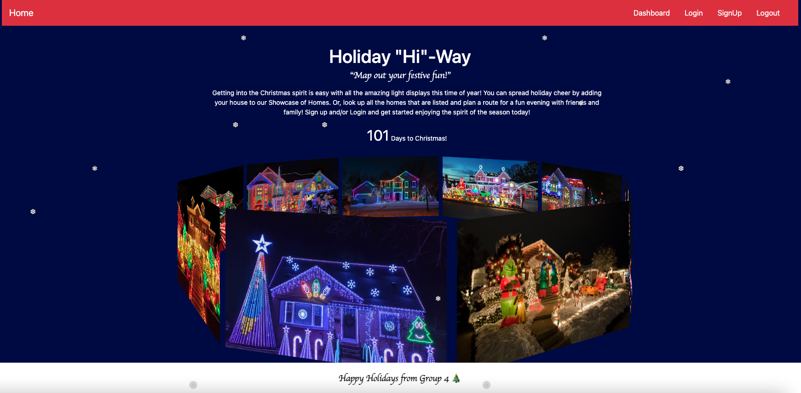

# holiday-hiway

## Description

This is an MVC application/dashboard where users can add their Christmas-decorated home to a database to be offered for others to pull up and go see for a fun family outing.
The initial application allows users to signup/login in order to upload a house to be viewed and pull up a list of all homes to view in order to plan a festive evening outing of holiday decorations.

The app utilizes the bcrypt package to protect against unauthorized use. In addition, the app utilizes the MySQL2, Sequalize, express-handlebars, dotenv, express-session and connect-session-sequelize packages to carry out functionality. Mockplus.com was also employed for UI quality enhancements. The https://anvil.works/advent/days-until-christmas-api was used for the awesome Christmas countdown on the home page.

Due to development [Issues](#issues) more work is needed to implement all desired features.

### Future expansion thoughts:

- Implementing Cloudinary/Multer to allow uploading a picture to each showcase home,
- Adding updating and deleting buttons to posted houses,
- Ability to view existing posted homes by zip code on the viewing homes page,
- Include feature to comment and update comments on homes
- User ability to plan a route using Mapbox API, https://www.mapbox.com/, to view decorated homes,
- Possible ability for user to select specific houses to go see and then create a map with only those self selected homes
- App could be upgraded to include more holiday options (eg. Fireworks displays, Easter Egg hunts, Halloween decorations, Trick or Treating allergy guide)

Go to deployed app here: https://holiday-hiway.herokuapp.com/

## Table of Contents

- [Installation](#installation)
- [Usage](#usage)
- [Issues](#issues)
- [License](#license)
- [Contributing](#contributing)
- [Questions](#questions)
- [Images](#images)

## Installation

This app not designed for installation.

## Usage

Application is deployed to Heroku server for interaction.

Expected use is:

AS someone looking for spreading and seeing festive cheer in the holiday season

I WANT to be able to show off my awesome holiday decorations

SO THAT other can feel the Christmas Spirit

I WANT to identify a route to other registered houses in a designated geographical area

SO THAT I can plan a fun family night to see everyone else’s holiday efforts

## Issues

- Could not get Cloudinary and Multer to work for user photo upload
- Did not have time to get all features activated due to time constraints and team communication limits

## License

This project is not currently licensed.

## Contributing

You can contribute to this project by either:

- contacting us and collaborating with your ideas on how to make it better! OR
- downloading the code, updating with your own ideas, and then sending me a pull request for review!

## Questions

See more details at https://www.github.com/cduwors or contact cduwors@mail.com.

GitHub Repository: https://github.com/cduwors/holiday-hiway

## Images

Input Sample

